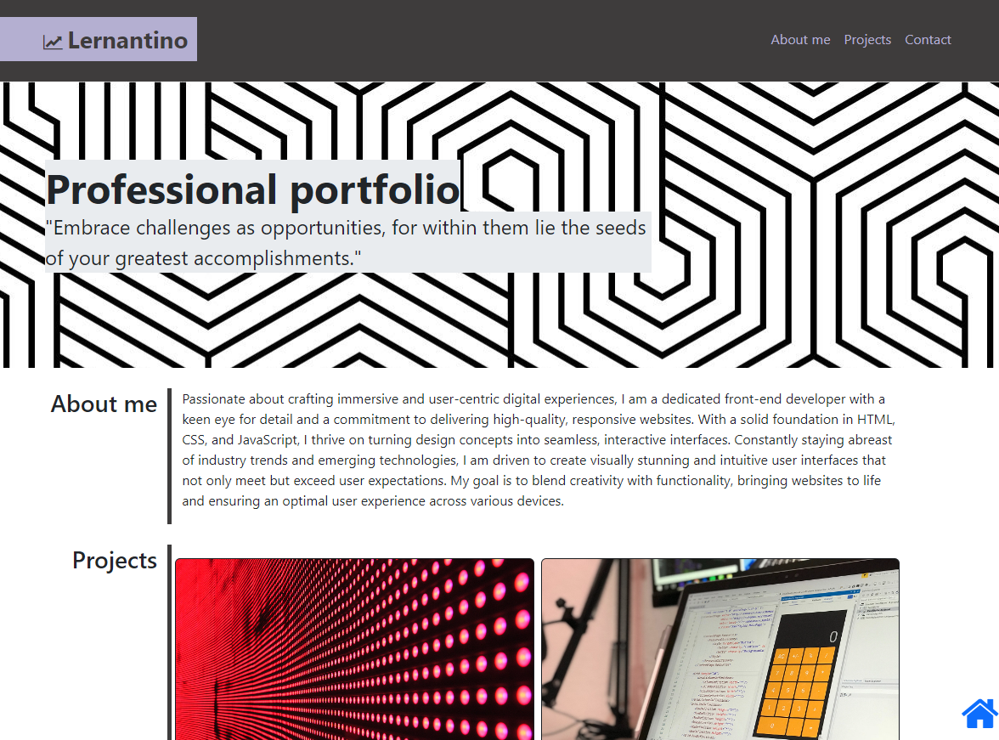
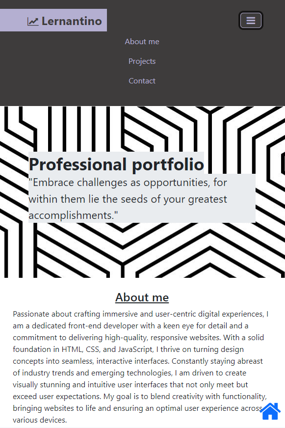

# Bootstrap-Portfolio
Bootstrap version of my portfolio

## Features

##### Navigation Bar
- Responsive navigation bar using Bootstrap.
- Logo and toggle button for smaller screens.
- Navigation links: "About me," "Projects," and "Contact."

##### Fixed Bottom Icon
- A fixed-bottom home icon that scrolls to the top of the page when clicked.

##### Jumbotron Section
- Visually appealing section with a title and a quote.

##### About Me Section
- Information about me, highlighting skills, passion, and commitment as a front-end developer.

##### Projects Section
- Showcase of projects with responsive cards.
- Each project card includes an image, title, and technologies used.

##### Contact Section
- Contact information: email, phone, and GitHub profile.

##### Responsive Design
- Bootstrap classes ensure responsiveness for various device sizes.

##### External Libraries
- Utilization of external libraries such as Bootstrap and Font Awesome for styling and icons.

##### Smooth Scrolling
- Navigation links use anchor tags with corresponding IDs to achieve smooth scrolling to different sections of the page.

##### JavaScript Dependencies
- Inclusion of JavaScript libraries like Popper.js and Bootstrap.js for handling navigation toggle functionality.

Desktop version:

Mobile version:
